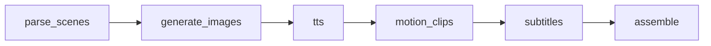

# 小说转短视频 (Novel to Short Video)

基于 **FastAPI + JSON 配置** 的 AIGC 流水线 MVP：DeepSeek 分镜、ComfyUI / Mock 生图、Edge TTS 配音、FFmpeg Ken Burns 与成片合成。

## 技术栈

| 环节 | 技术 |
|------|------|
| API | FastAPI + Uvicorn |
| 配置 | `config/*.json` + `.env` 密钥 |
| 分镜 | DeepSeek API（OpenAI 兼容） |
| 图像 | ComfyUI HTTP API + IP-Adapter（可 `mock`） |
| 配音 | edge-tts |
| 视频 | FFmpeg（Ken Burns、concat、字幕烧录） |

## 环境要求

- Python 3.10+
- [FFmpeg](https://ffmpeg.org/download.html) 已加入 `PATH`（含 `ffprobe`）
- （可选）本地 [ComfyUI](https://github.com/comfyanonymous/ComfyUI)，默认 `http://127.0.0.1:8188`
- DeepSeek API Key

## 快速开始

```bash
cd python_agic
python -m venv .venv
.venv\Scripts\activate          # Windows
pip install -r requirements.txt
copy .env.example .env          # 填入 DEEPSEEK_API_KEY
python run.py
```

服务默认：`http://127.0.0.1:8000`  
文档：`http://127.0.0.1:8000/docs`

### 健康检查

```bash
curl http://127.0.0.1:8000/health
```

返回 FFmpeg / ComfyUI 是否可用；`comfyui_mock: true` 表示使用占位图（见 `config/comfyui.json` 的 `"mock": true`）。

### 创建项目

```bash
curl -X POST http://127.0.0.1:8000/projects ^
  -H "Content-Type: application/json" ^
  -d "{\"title\": \"demo\", \"text\": \"夜色如墨，少年推门而入。烛光摇曳，墙上映出一道修长的人影。他低声道：我来了。\"}"
```

响应示例：

```json
{"project_id": "uuid", "status": "pending"}
```

### 查询进度

```bash
curl http://127.0.0.1:8000/projects/{project_id}
```

状态流转：`pending` → `parsing` → `imaging` → `audio` → `motion` → `subtitles` → `assembling` → `done`

### 下载成片

```bash
curl -O -J http://127.0.0.1:8000/projects/{project_id}/download
```

产物目录：`data/{project_id}/`

```
data/{id}/
├── scenes.json      # 分镜与角色
├── images/          # 场景图
├── audio/           # TTS mp3
├── clips/           # 分镜视频
├── subs/full.ass    # 字幕
└── output/final.mp4 # 成片
```

## 配置说明

所有业务参数在 `config/` 下 JSON 文件中，密钥通过 `${ENV_VAR}` 引用：

| 文件 | 作用 |
|------|------|
| `app.json` | 端口、数据目录 |
| `llm.json` | DeepSeek 地址、模型、分镜 system prompt |
| `comfyui.json` | ComfyUI 地址、`mock`、节点字段映射 |
| `tts.json` | edge-tts 音色 |
| `ffmpeg.json` | 分辨率 1080×1920、Ken Burns、字幕样式 |
| `pipeline.json` | 场景数上限、阶段列表、重试次数 |

### 关闭 Mock、接入真实 ComfyUI

1. 启动 ComfyUI：`python main.py --listen`
2. 在 ComfyUI 中搭建 IP-Adapter 工作流，**Save (API Format)** 导出到 `workflows/ipadapter_scene.json`
3. 在 `config/comfyui.json` 中更新 `input_mappings`，将 `positive_prompt`、`reference_image` 等映射到对应节点 id
4. 设置 `"mock": false`

### 无 API Key 本地调试

在 `config/llm.json` 中设置 `"mock": true`，将使用内置示例分镜，无需 DeepSeek 密钥。

### 环境变量（`.env`）

```
DEEPSEEK_API_KEY=sk-...
COMFYUI_HOST=http://127.0.0.1:8188
```

## 流水线阶段



TTS 在动效之前执行，以便按旁白时长生成镜头，避免音画不同步。

## 二期扩展（未实现）

- Celery + Redis 任务队列
- Kling / Runway 图生视频（`pipeline.json` → `motion.mode: i2v`）
- 对象存储 OSS、质量评分过滤

## 常见问题

**`DEEPSEEK_API_KEY not set`**  
复制 `.env.example` 为 `.env` 并填写密钥。

**`ffmpeg not found`**  
安装 FFmpeg 并确保 `ffmpeg`、`ffprobe` 在 PATH 中。

**ComfyUI 超时**  
检查 GPU 服务是否运行；开发阶段可保持 `"mock": true` 用占位图跑通全流程。

**字幕未显示**  
Windows 需安装 `config/ffmpeg.json` 中指定的字体（默认微软雅黑），或修改 `subtitle.font_name`。
